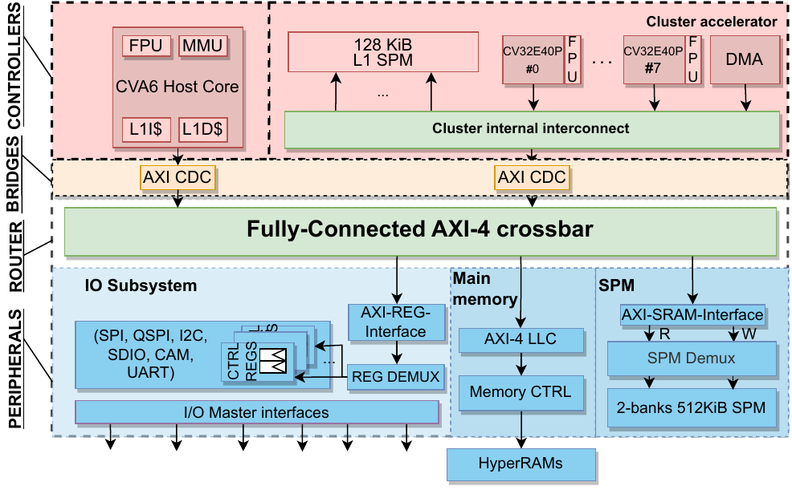

# TOP: Towards Open and Predictable Heterogeneous SoCs

This repo provides a simple way of reproducing the results shown in the paper "TOP: Towards Open and Predictable Heterogeneous SoCs".
It is developed as part of the [PULP](https://pulp-platform.org/) project, a joint effort between ETH Zurich and the University of Bologna.

## Repo organization

The `test` folder contains the sample architecture (figure below), instantiated with generic AXI managers, able to issue multiple
outstanding transactions toward the AXI subordinates. 



The managers and subordinate can be configured to have a variable number of outstanding transaction.

To run the tests with different configurations, you can just run:

```
make build results

```

Then, to process the traces and produce the graphs:

```
python3 profile_system.py

```

## Software tests

The software tests can be run on [carfield](https://github.com/pulp-platform/carfield/tree/main).

To do so:

```
git clone https://github.com/pulp-platform/carfield/tree/main
cd carfield
git checkout ddc9c04733461f8edae334be8022cd80d934c3d8
make car-init
make car-hw-build
make car-sw-build
make car-hw-sim CHS_BOOTMODE=0 CHS_PRELMODE=1 CHS_BINARY=./sw/tests/bare-metal/hostd/pulp-offload-intf.interference.car.dram.elf 
```

In these tests, CVA6 and the cluster's cores perform strided accesses to cause as many L1 cache and LLC misses as possible.